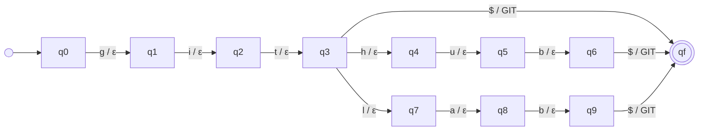

# Formalization

## 1. Regular expressions (stage 1: extraction)

Implementation: `src/resumelens/extraction/patterns.py` (the patterns) and `src/resumelens/extraction/extractor.py` (where they are applied).

Each regular expression $r$ denotes a regular language $L(r) \subseteq \Sigma^*$, where $\Sigma$ is the set of characters that can appear in a résumé. The extractor returns every non-overlapping substring of the résumé that belongs to $L(r)$ (`re.finditer`). This stage does **not** decide whether two strings are equivalent (stage 2) or whether a candidate fits a profile (stage 3).

### Design decisions

- **One category, one transducer.** Each technical category (`programming_languages`, `frameworks`, `libraries`, `databases`, `tools`, `other_qualifications`) has its own regex, and in stage 2 its own transducer. That keeps each formal model small enough to draw.
- **Our own word boundaries.** Python's `\b` does not work with names like `Node.js` or `C#`, because `.`, `+` and `#` are not word characters. We use `BEFORE = (?<![\w+#&.])` and `AFTER = (?![\w+#&]|\.\w)`. Because of `BEFORE`, the `JS` inside `Node.JS` is not taken as a language. Because of `AFTER`, `github` inside `github.com/...` is not taken as the tool Git.
- **Optional separators.** `SEP = [\s.\-]?` lets one pattern accept `Scikit-learn`, `scikit learn` and `scikitlearn`.
- **Short names are case-sensitive.** `JS`, `TS`, `Go`, `R`, `REST` and `Express` are also ordinary words (*go home*, *the rest*, *R&D*), so they have a separate regex without `re.IGNORECASE` and only match with that exact capitalization. Every other technical regex is case-insensitive.
- **Longest match wins.** When two regexes of the same category match at overlapping positions (`REST` and `REST APIs`), only the longest one is kept (`find_all_in_order`).
- **Named groups.** Education and experience use named groups (`degree`, `field`, `institution`, `years`, `description`), so the result goes straight into the DSL in stage 4.
- **Output.** An `ExtractionResult` object (`src/resumelens/models.py`). `ResumeExtractor.save_json(path)` saves it as JSON.

### Known limitations

- A date written as `2019.10.07` can match the phone pattern.
- The name is only detected when it is the first non-empty line.
- Spellings that are not listed (e.g. `ECMAScript`) are not extracted. If they appear under `Skills:`, they show up in `get_unrecognized_skills()`.

### Example (assignment fragment)

Input:

```text
Wednesday Addams
3 years of experience developing web applications.
Technical Skills:
JS, React.js, NodeJS, Postgres, Git.
```

Output of `get_all_technical_strings()`: `["JS", "React.js", "NodeJS", "Postgres", "Git"]`. This is the input of stage 2.

### Patterns

#### `name`

**Language recognized:** Two to five capitalized words separated by spaces. It is only checked against the first non-empty line.

```regex
[A-ZÀ-Ý][A-Za-zÀ-ÿ'\-]+(\s+[A-ZÀ-Ý][A-Za-zÀ-ÿ'\-]+){1,4}
```

#### `emails`

**Language recognized:** local part, '@', domain labels separated by dots and a top level domain of 2 or more letters.

```regex
(?<![\w.+-])[A-Za-z0-9._%+-]+@[A-Za-z0-9-]+(\.[A-Za-z0-9-]+)*\.[A-Za-z]{2,}(?![\w-])
```

#### `phones`

**Language recognized:** Optional '+', then a prefix (can be in parentheses) followed by 2 to 4 digit blocks, each one after exactly one space, dot or hyphen. Or 7 to 15 digits together.

```regex
(?<![\w+])(\+?\(?\d{1,4}\)?([\s.\-]\d{2,4}){2,4}|\+?\d{7,15})(?!\w)
```

#### `links`

**Language recognized:** Text that starts with http://, https:// or www. (or linkedin.com/, github.com/) until the next space or comma.

```regex
(https?://|www\.)[^\s,;]*[^\s,;.]|(?<![\w.])(linkedin|github)\.com/[^\s,;]*[^\s,;.]
```

#### `programming_languages`

**Language recognized:** JavaScript, TypeScript, Python, Java, Go, Kotlin, C# and R with their usual spellings. JS, TS, Go and R only with that exact capitalization.

```regex
(?<![\w+#&.])(java[\s\-]?script|type[\s\-]?script|python(\s?3)?|java|golang|kotlin|c\s?#|c[\s\-]sharp|csharp)(?![\w+#&]|\.\w)
```
_(case-insensitive)_

```regex
(?<![\w+#&.])(JS|TS|Go|R)(?![\w+#&]|\.\w)
```
_(case-sensitive)_

#### `frameworks`

**Language recognized:** React, Angular, Vue, Node and Express with or without '.js'/'JS', plus Django, Flask, FastAPI, Spring Boot and .NET.

```regex
(?<![\w+#&.])(react([\s.\-]?js)?|angular([\s.\-]?js)?|vue([\s.\-]?js)?|node([\s.\-]?js)?|express[\s.\-]?js|django|flask|fast[\s\-]?api|spring[\s\-]?boot|asp\.net(\s?core)?|\.net(\s?core)?|dotnet)(?![\w+#&]|\.\w)
```
_(case-insensitive)_

```regex
(?<![\w+#&.])(Express)(?![\w+#&]|\.\w)
```
_(case-sensitive)_

#### `libraries`

**Language recognized:** Python data, machine learning and plotting libraries, allowing a space or hyphen inside compound names (Tensor Flow, Scikit-learn, Py Torch).

```regex
(?<![\w+#&.])(pandas|num[\s\-]?py|scikit[\s\-]?learn|sk[\s\-]?learn|tensor[\s\-]?flow|py[\s\-]?torch|keras|matplotlib|seaborn|plotly)(?![\w+#&]|\.\w)
```
_(case-insensitive)_

#### `databases`

**Language recognized:** PostgreSQL/Postgres, MySQL, MongoDB/Mongo, SQLite, Redis and the SQL language.

```regex
(?<![\w+#&.])(postgres|postgre\s?sql|my\s?sql|mongo(\s?db)?|sqlite|redis|sql)(?![\w+#&]|\.\w)
```
_(case-insensitive)_

#### `tools`

**Language recognized:** Git, GitHub, GitLab, Docker, Kubernetes/k8s, Tableau and Power BI.

```regex
(?<![\w+#&.])(git|github|gitlab|docker|kubernetes|k8s|tableau|power[\s\-]?bi)(?![\w+#&]|\.\w)
```
_(case-insensitive)_

#### `other_qualifications`

**Language recognized:** REST, RESTful, REST APIs, GraphQL, statistics and statistical analysis. REST alone only in upper case.

```regex
(?<![\w+#&.])(rest(ful)?[\s\-]?apis?|restful|graph\s?ql|statistics|statistical(\s+(analysis|modeling|modelling))?)(?![\w+#&]|\.\w)
```
_(case-insensitive)_

```regex
(?<![\w+#&.])(REST)(?![\w+#&]|\.\w)
```
_(case-sensitive)_

#### `education`

**Language recognized:** A degree (BS, BSc, MSc, PhD, Bachelor's, Master's...) followed by 'in' or 'of', a field that starts with a capital letter and optionally ', Institution' or 'at Institution'.

```regex
(?<!\w)(?P<degree>Ph\.?\s?D\.?|M\.?\s?Sc\.?|B\.?\s?Sc\.?|M\.?S\.?|B\.?S\.?|B\.?A\.?|M\.?A\.?|Doctorate|(Bachelor|Master)('s)?(\s+of\s+(Science|Arts|Engineering))?)(\s+degree)?\s+(in|of)\s+(?P<field>[A-Z][A-Za-z&/ ]*?[A-Za-z])((\s*[,\-]\s*|\s+(at|from)\s+)(?P<institution>[A-Z][\w&.' ]*?\w))?\s*(?=[.;\n]|$)
```

#### `experience`

**Language recognized:** A number of years, 'years of experience' and an optional description until the end of the sentence.

```regex
(?<!\w)(?P<years>\d{1,2})\+?\s*(years?|yrs?)\s+of\s+(professional\s+)?experience(\s+(?P<description>[^.\n]+))?
```

#### `skills_section`

**Language recognized:** A line that starts with 'Skills:' or 'Technical Skills:'. Its items are split by commas, semicolons or bars.

```regex
^\s*(technical\s+)?skills\s*:\s*(?P<items>.+)$
```


## 2. Finite-state transducers (stage 2: normalization)

Implementation: `src/resumelens/normalization/variants.py` (the transformations), `transducers.py` (the pyformlang FSTs), `normalizer.py` (applying them) and `sorter.py` (canonical order).

The same qualification can be written in many ways (`JS`, `Javascript`, `JavaScript`). Normalization uses finite-state transducers to map every variant to one canonical token. Each transducer is a 7-tuple

$$M = (Q, \Sigma, \Gamma, \delta, \omega, q_0, F)$$

where $\delta : Q \times \Sigma \to Q$ is the transition function and $\omega : Q \times \Sigma \to \Gamma^*$ is the output function. A string $w$ is translated if, reading it from $q_0$, the transducer ends in a state of $F$. The translation is the concatenation of the outputs of the transitions it took. When a pair $(q, a)$ is not defined, the string is rejected.

Each string goes through **two transducers in sequence** (composition):

```text
"Scikit-learn" --M_pre--> "scikitlearn" --(append $)--> "scikitlearn$" --M_libraries--> SCIKIT_LEARN
```

### 2.1 Preprocessing transducer $M_{pre}$

| Part | Value |
|---|---|
| $Q$ | $\{q_0\}$ |
| $\Sigma$ | $\{A..Z,\ a..z,\ 0..9,\ +,\ \#,\ ␣,\ .,\ -,\ \_,\ /\}$ (71 symbols) |
| $\Gamma$ | $\{a..z,\ 0..9,\ +,\ \#\}$ |
| $\delta$ | $\delta(q_0, x) = q_0$ for every $x \in \Sigma$ |
| $\omega$ | $\omega(q_0, X) = $ lower case of $X$ for $X \in A..Z$; $\omega(q_0, x) = x$ for $x \in a..z,\ 0..9,\ +,\ \#$; $\omega(q_0, s) = \varepsilon$ for $s \in \{␣, ., -, \_, /\}$ |
| $q_0$ | $q_0$ |
| $F$ | $\{q_0\}$ |

It is a one-state transducer, so the language it accepts is $\Sigma^*$. Its job is to remove differences in case and separators, so `Tensor Flow`, `TensorFlow` and `tensor-flow` all become `tensorflow`. A character outside $\Sigma$ (like `é`) makes it reject the string. Full table and diagram: [diagrams/transducers/preprocessing.md](diagrams/transducers/preprocessing.md).

### 2.2 Category transducers $M_c$

There is one transducer for each technical category $c$ found in stage 1. They are all built the same way (`build_category_transducer`) from the table of variants $V_c$ in `variants.py`:

| Part | Value |
|---|---|
| $Q$ | $\{q_0, q_f\} \cup$ one state for each prefix of a variant in $V_c$ (a **trie**) |
| $\Sigma$ | the characters used in the variants of $V_c$, plus the end mark `$` |
| $\Gamma$ | the canonical tokens of category $c$ |
| $\delta$ | $\delta(p, a) = pa$ when $pa$ is a prefix of a variant; $\delta(w, \$) = q_f$ when $w \in V_c$ |
| $\omega$ | $\omega(p, a) = \varepsilon$ for every character; $\omega(w, \$) = V_c(w)$, the canonical token of the variant $w$ |
| $q_0$ | $q_0$ (the empty prefix) |
| $F$ | $\{q_f\}$ |

Size of each one:

| Transducer | Variants | States | Transitions | Canonical tokens (Γ) |
|---|---|---|---|---|
| `programming_languages` | 13 | 51 | 62 | JAVASCRIPT, TYPESCRIPT, PYTHON, JAVA, GO, KOTLIN, CSHARP, R |
| `frameworks` | 19 | 85 | 102 | REACT, ANGULAR, VUE, NODE_JS, EXPRESS, DJANGO, FLASK, FASTAPI, SPRING_BOOT, DOTNET |
| `libraries` | 10 | 72 | 80 | PANDAS, NUMPY, SCIKIT_LEARN, TENSORFLOW, PYTORCH, KERAS, MATPLOTLIB, SEABORN, PLOTLY |
| `databases` | 8 | 34 | 40 | POSTGRESQL, MYSQL, MONGODB, SQLITE, REDIS, SQL |
| `tools` | 8 | 43 | 49 | GIT, DOCKER, KUBERNETES, TABLEAU, POWER_BI |
| `other_qualifications` | 12 | 56 | 66 | REST_API, GRAPHQL, STATISTICS |

Complete 7-tuples (every transition with its output) and diagrams:
[programming_languages](diagrams/transducers/programming_languages.md) ·
[frameworks](diagrams/transducers/frameworks.md) ·
[libraries](diagrams/transducers/libraries.md) ·
[databases](diagrams/transducers/databases.md) ·
[tools](diagrams/transducers/tools.md) ·
[other_qualifications](diagrams/transducers/other_qualifications.md).
They are generated from the pyformlang objects with `python -m resumelens.docs_export`, so the documentation and the code can't disagree.

#### Example: part of $M_{tools}$ (the variants of GIT)



Run on `github$`: $q_0 \xrightarrow{g/\varepsilon} q_1 \xrightarrow{i/\varepsilon} q_2 \xrightarrow{t/\varepsilon} q_3 \xrightarrow{h/\varepsilon} q_4 \xrightarrow{u/\varepsilon} q_5 \xrightarrow{b/\varepsilon} q_6 \xrightarrow{\$/GIT} q_f$, output `GIT`.
Run on `gi$`: from $q_2$ there is no transition on `$`, so the string is rejected.

### 2.3 Design decisions

- **Two transducers in sequence instead of one.** Without preprocessing, the trie would need a branch for every combination of case and separator (`React.js`, `ReactJS`, `react js`...). With it, each canonical token needs only a few variants.
- **One transducer per category.** A single trie for all ~70 variants would have more than 300 states and could not be drawn or explained. Splitting by category keeps each model small, and it reuses the categories from stage 1, so a string is only compared with the variants of its own category. (`React` under `databases` is rejected.)
- **End mark `$`.** `postgres` is a prefix of `postgresql`. If the output were written while reading the last letter, the transducer could not know whether the word ends there. With the mark, the output is written only when the whole word has been read, and the transducer stays **deterministic** (at most one transition for each $(q, a)$, checked in `tests/test_transducers.py`).
- **Output only at the end.** Every character transition writes $\varepsilon$, so a rejected string produces no partial output.
- **Prefix sharing (trie).** Variants with a common beginning share states (`git`, `github`, `gitlab` share $q_0 \dots q_3$).
- **Unknown strings are kept apart.** A string that a transducer rejects is not invented into a token. It is reported in `NormalizationResult.unknown`.
- **Duplicates are removed.** `JS` and `JavaScript` produce the same token once.

### 2.4 Our transformations

Besides the examples in the assignment (`JS → JAVASCRIPT`, `React.js → REACT`, `NodeJS → NODE_JS`, `Postgres → POSTGRESQL`, `sklearn → SCIKIT_LEARN`, `Tensor Flow → TENSORFLOW`, `Py Torch → PYTORCH`...), we added the ones our two profiles need:

| Variants | Canonical token |
|---|---|
| `C#`, `c sharp`, `csharp` | CSHARP |
| `Go`, `Golang` | GO |
| `TS`, `TypeScript` | TYPESCRIPT |
| `.NET`, `.NET Core`, `ASP.NET`, `dotnet` | DOTNET |
| `Spring Boot`, `SpringBoot`, `spring-boot` | SPRING_BOOT |
| `Express`, `Express.js` | EXPRESS |
| `Mongo`, `MongoDB` | MONGODB |
| `Git`, `GitHub`, `GitLab` | GIT |
| `Kubernetes`, `k8s` | KUBERNETES |
| `Power BI`, `PowerBI` | POWER_BI |
| `REST`, `RESTful`, `REST API(s)`, `RESTful API(s)` | REST_API |
| `Statistics`, `statistical analysis`, `statistical modeling` | STATISTICS |

### 2.5 Canonical order (sorting)

Before classification, the normalized tokens are put in the order defined by each profile (`sorter.py`). The order is the order of the profile groups, and inside a group the order of the JSON file. Tokens that are not in the profile's alphabet are left out, so each automaton only reads symbols of its own $\Sigma$, and the result does not depend on the order in which the candidate wrote the skills.

Example from the assignment (Full Stack): `Git, NodeJS, JS, Postgres, React.js` → normalization → `GIT, NODE_JS, JAVASCRIPT, POSTGRESQL, REACT` → sorting → `JAVASCRIPT, REACT, NODE_JS, POSTGRESQL, GIT`.

## 3. Automata formalization

The profile classification stage uses finite automata over the sorted normalized token stream.

### Reference ML automaton

The canonical accepted pattern for the ML profile is:

`q0 -PYTHON-> q1 -{PANDAS,NUMPY}-> q2 -{SCIKIT_LEARN,TENSORFLOW,PYTORCH}-> q3 -{SQL,POSTGRESQL}-> q4 -GIT-> q5`

with `q5` accepting.

### 5-tuple for automata

For a profile automaton A = (Q, Σ, δ, q0, F):

| Symbol | Meaning | Example |
| --- | --- | --- |
| Q | Finite set of states | `{q0, q1, q2, q3, q4, q5}` |
| Σ | Input alphabet | `{PYTHON, PANDAS, NUMPY, SCIKIT_LEARN, TENSORFLOW, PYTORCH, SQL, POSTGRESQL, GIT}` |
| δ | Transition function | State transitions on accepted tokens |
| q0 | Start state | `q0` |
| F | Accepting states | `{q5}` |

### Type justification

The ML-like pattern is naturally expressed as an NFA because it contains transitions on sets of possible tokens (`{PANDAS, NUMPY}` and `{SCIKIT_LEARN, TENSORFLOW, PYTORCH}`), which is easier to specify than a DFA with a fully enumerated transition table. The implementation may still be determinized internally by `pyformlang` if required.

### Full Stack automaton

The Full Stack profile can be modeled analogously, for example:

`q0 -{JS,TS}-> q1 -{REACT,ANGULAR,VUE}-> q2 -{NODE_JS,DJANGO,SPRING_BOOT}-> q3 -{SQL,POSTGRESQL,MONGODB}-> q4 -REST-> q5 -GIT-> q6`

with `q6` accepting.

## 4. Candidate profile language (CFG, textX)

The DSL organizes a résumé candidate into candidate metadata, repeated experience blocks, repeated education blocks, repeated normalized skills, and the profile classification outcome.

### EBNF skeleton

```ebnf
resume          = {personal_info, contact_info, experience_block, education_block, skill_block, profile_result};
personal_info   = 'candidate', ':', IDENT, ',', 'name', ':', STRING ;
contact_info    = 'email', ':', EMAIL, ',', 'phone', ':', PHONE ;
experience_block = 'experience', ':', '{', experience_entry, { ',', experience_entry }, '}' ;
experience_entry = 'role', ':', STRING, ',', 'years', ':', NUMBER ;
education_block = 'education', ':', '{', education_entry, { ',', education_entry }, '}' ;
education_entry = 'degree', ':', STRING, ',', 'institution', ':', STRING ;
skill_block     = 'skills', ':', '[', skill, { ',', skill }, ']' ;
skill           = IDENT ;
profile_result  = 'profile', ':', IDENT, ',', 'status', ':', ('ACCEPTED' | 'REJECTED') ;

IDENT           = /[A-Za-z_][A-Za-z0-9_\-]*/ ;
STRING          = /"[^"]*"/ | /'[^"]*'/ ;
EMAIL           = /[A-Za-z0-9._%+-]+@[A-Za-z0-9.-]+\.[A-Za-z]{2,}/ ;
PHONE           = /\+?[0-9()\-\s]{7,}/ ;
NUMBER          = /[0-9]+/ ;
```

### Structural characteristics

- Personal and contact data are explicit.
- Experience and education are repeated blocks rather than single values.
- Skills are normalized and represented as canonical tokens.
- Classification results are stored as explicit accepted/rejected profile checks.
- The grammar is intentionally small and academically tractable for the assignment.

## 5. TODOs for the final formalization document

- Fill in the exact formal tuples for each implemented profile.
- Add diagrams for the transducer and automata states.
- Add precise lexical rules if the team expands the DSL.
- Confirm the final set of profile keywords for PROFILE_3_TODO and PROFILE_4_TODO.
