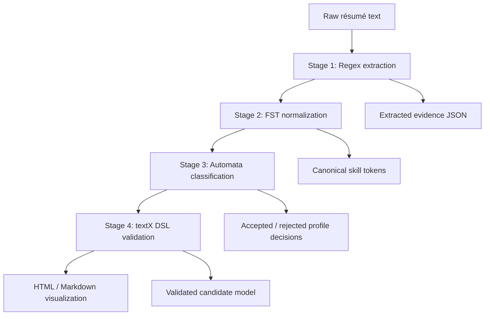

# Architecture

## Overview

This project uses a staged pipeline with explicit operations on strings, canonical tokens, automata, and a domain-specific language.

## Component diagram

## Responsibilities

- Stage 1 extracts concrete evidence using regular expressions.
- Stage 2 resolves lexical variants and enforces canonical ordering.
- Stage 3 matches explicit qualification patterns against profile automata.
- Stage 4 validates the structured output and renders it visually.

## Design constraints

- No ranking logic is included.
- No hiring decisions are made.
- The system is intentionally pattern-based and transparent.

## TODO
- Add more detailed data-flow diagrams once the final profile requirements are chosen.
- Export a graph of the transducer and automata to `docs/diagrams/` as image files.
