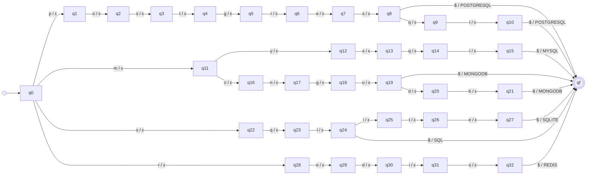

# Transducer databases

_Generated by `python -m resumelens.docs_export` from the pyformlang objects._

## Diagram

## Formal definition

M = (Q, Σ, Γ, δ, ω, q0, F)

- **Q** (34 states) = {q0, qf, q1, q2, q3, q4, q5, q6, q7, q8, q9, q10, q11, q12, q13, q14, q15, q16, q17, q18, q19, q20, q21, q22, q23, q24, q25, q26, q27, q28, q29, q30, q31, q32}
- **Σ** = {`p`, `o`, `s`, `t`, `g`, `r`, `e`, `$`, `q`, `l`, `m`, `y`, `n`, `d`, `b`, `i`}
- **Γ** = {`POSTGRESQL`, `MYSQL`, `MONGODB`, `SQLITE`, `REDIS`, `SQL`}
- **q0** = q0
- **F** = {qf}
- **δ** and **ω** (40 transitions). Each row is δ(state, input) = next state and ω(state, input) = output. Every pair that is not in the table is undefined, so the input is rejected.

| state | input | δ: next state | ω: output |
|---|---|---|---|
| q0 | `p` | q1 | ε |
| q1 | `o` | q2 | ε |
| q2 | `s` | q3 | ε |
| q3 | `t` | q4 | ε |
| q4 | `g` | q5 | ε |
| q5 | `r` | q6 | ε |
| q6 | `e` | q7 | ε |
| q7 | `s` | q8 | ε |
| q8 | `$` | qf | POSTGRESQL |
| q8 | `q` | q9 | ε |
| q9 | `l` | q10 | ε |
| q10 | `$` | qf | POSTGRESQL |
| q0 | `m` | q11 | ε |
| q11 | `y` | q12 | ε |
| q12 | `s` | q13 | ε |
| q13 | `q` | q14 | ε |
| q14 | `l` | q15 | ε |
| q15 | `$` | qf | MYSQL |
| q11 | `o` | q16 | ε |
| q16 | `n` | q17 | ε |
| q17 | `g` | q18 | ε |
| q18 | `o` | q19 | ε |
| q19 | `$` | qf | MONGODB |
| q19 | `d` | q20 | ε |
| q20 | `b` | q21 | ε |
| q21 | `$` | qf | MONGODB |
| q0 | `s` | q22 | ε |
| q22 | `q` | q23 | ε |
| q23 | `l` | q24 | ε |
| q24 | `i` | q25 | ε |
| q25 | `t` | q26 | ε |
| q26 | `e` | q27 | ε |
| q27 | `$` | qf | SQLITE |
| q0 | `r` | q28 | ε |
| q28 | `e` | q29 | ε |
| q29 | `d` | q30 | ε |
| q30 | `i` | q31 | ε |
| q31 | `s` | q32 | ε |
| q32 | `$` | qf | REDIS |
| q24 | `$` | qf | SQL |
