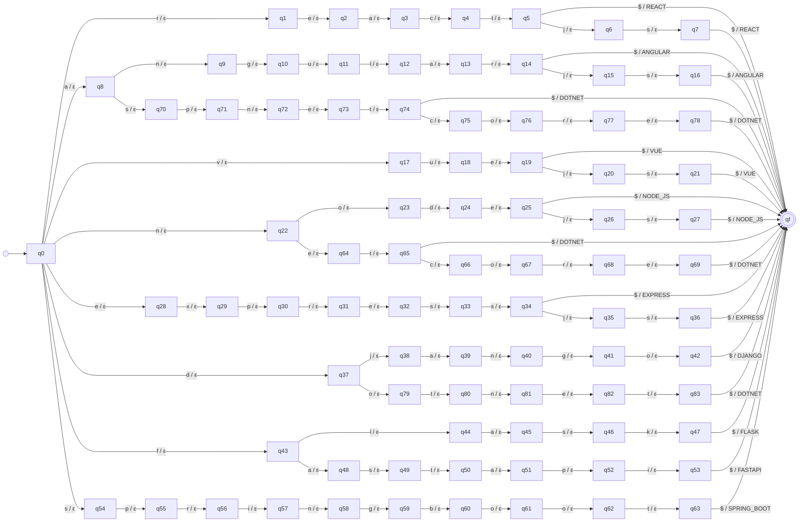

# Transducer frameworks

_Generated by `python -m resumelens.docs_export` from the pyformlang objects._

## Diagram

## Formal definition

M = (Q, Σ, Γ, δ, ω, q0, F)

- **Q** (85 states) = {q0, qf, q1, q2, q3, q4, q5, q6, q7, q8, q9, q10, q11, q12, q13, q14, q15, q16, q17, q18, q19, q20, q21, q22, q23, q24, q25, q26, q27, q28, q29, q30, q31, q32, q33, q34, q35, q36, q37, q38, q39, q40, q41, q42, q43, q44, q45, q46, q47, q48, q49, q50, q51, q52, q53, q54, q55, q56, q57, q58, q59, q60, q61, q62, q63, q64, q65, q66, q67, q68, q69, q70, q71, q72, q73, q74, q75, q76, q77, q78, q79, q80, q81, q82, q83}
- **Σ** = {`r`, `e`, `a`, `c`, `t`, `$`, `j`, `s`, `n`, `g`, `u`, `l`, `v`, `o`, `d`, `x`, `p`, `f`, `k`, `i`, `b`}
- **Γ** = {`REACT`, `ANGULAR`, `VUE`, `NODE_JS`, `EXPRESS`, `DJANGO`, `FLASK`, `FASTAPI`, `SPRING_BOOT`, `DOTNET`}
- **q0** = q0
- **F** = {qf}
- **δ** and **ω** (102 transitions). Each row is δ(state, input) = next state and ω(state, input) = output. Every pair that is not in the table is undefined, so the input is rejected.

| state | input | δ: next state | ω: output |
|---|---|---|---|
| q0 | `r` | q1 | ε |
| q1 | `e` | q2 | ε |
| q2 | `a` | q3 | ε |
| q3 | `c` | q4 | ε |
| q4 | `t` | q5 | ε |
| q5 | `$` | qf | REACT |
| q5 | `j` | q6 | ε |
| q6 | `s` | q7 | ε |
| q7 | `$` | qf | REACT |
| q0 | `a` | q8 | ε |
| q8 | `n` | q9 | ε |
| q9 | `g` | q10 | ε |
| q10 | `u` | q11 | ε |
| q11 | `l` | q12 | ε |
| q12 | `a` | q13 | ε |
| q13 | `r` | q14 | ε |
| q14 | `$` | qf | ANGULAR |
| q14 | `j` | q15 | ε |
| q15 | `s` | q16 | ε |
| q16 | `$` | qf | ANGULAR |
| q0 | `v` | q17 | ε |
| q17 | `u` | q18 | ε |
| q18 | `e` | q19 | ε |
| q19 | `$` | qf | VUE |
| q19 | `j` | q20 | ε |
| q20 | `s` | q21 | ε |
| q21 | `$` | qf | VUE |
| q0 | `n` | q22 | ε |
| q22 | `o` | q23 | ε |
| q23 | `d` | q24 | ε |
| q24 | `e` | q25 | ε |
| q25 | `$` | qf | NODE_JS |
| q25 | `j` | q26 | ε |
| q26 | `s` | q27 | ε |
| q27 | `$` | qf | NODE_JS |
| q0 | `e` | q28 | ε |
| q28 | `x` | q29 | ε |
| q29 | `p` | q30 | ε |
| q30 | `r` | q31 | ε |
| q31 | `e` | q32 | ε |
| q32 | `s` | q33 | ε |
| q33 | `s` | q34 | ε |
| q34 | `$` | qf | EXPRESS |
| q34 | `j` | q35 | ε |
| q35 | `s` | q36 | ε |
| q36 | `$` | qf | EXPRESS |
| q0 | `d` | q37 | ε |
| q37 | `j` | q38 | ε |
| q38 | `a` | q39 | ε |
| q39 | `n` | q40 | ε |
| q40 | `g` | q41 | ε |
| q41 | `o` | q42 | ε |
| q42 | `$` | qf | DJANGO |
| q0 | `f` | q43 | ε |
| q43 | `l` | q44 | ε |
| q44 | `a` | q45 | ε |
| q45 | `s` | q46 | ε |
| q46 | `k` | q47 | ε |
| q47 | `$` | qf | FLASK |
| q43 | `a` | q48 | ε |
| q48 | `s` | q49 | ε |
| q49 | `t` | q50 | ε |
| q50 | `a` | q51 | ε |
| q51 | `p` | q52 | ε |
| q52 | `i` | q53 | ε |
| q53 | `$` | qf | FASTAPI |
| q0 | `s` | q54 | ε |
| q54 | `p` | q55 | ε |
| q55 | `r` | q56 | ε |
| q56 | `i` | q57 | ε |
| q57 | `n` | q58 | ε |
| q58 | `g` | q59 | ε |
| q59 | `b` | q60 | ε |
| q60 | `o` | q61 | ε |
| q61 | `o` | q62 | ε |
| q62 | `t` | q63 | ε |
| q63 | `$` | qf | SPRING_BOOT |
| q22 | `e` | q64 | ε |
| q64 | `t` | q65 | ε |
| q65 | `$` | qf | DOTNET |
| q65 | `c` | q66 | ε |
| q66 | `o` | q67 | ε |
| q67 | `r` | q68 | ε |
| q68 | `e` | q69 | ε |
| q69 | `$` | qf | DOTNET |
| q8 | `s` | q70 | ε |
| q70 | `p` | q71 | ε |
| q71 | `n` | q72 | ε |
| q72 | `e` | q73 | ε |
| q73 | `t` | q74 | ε |
| q74 | `$` | qf | DOTNET |
| q74 | `c` | q75 | ε |
| q75 | `o` | q76 | ε |
| q76 | `r` | q77 | ε |
| q77 | `e` | q78 | ε |
| q78 | `$` | qf | DOTNET |
| q37 | `o` | q79 | ε |
| q79 | `t` | q80 | ε |
| q80 | `n` | q81 | ε |
| q81 | `e` | q82 | ε |
| q82 | `t` | q83 | ε |
| q83 | `$` | qf | DOTNET |
