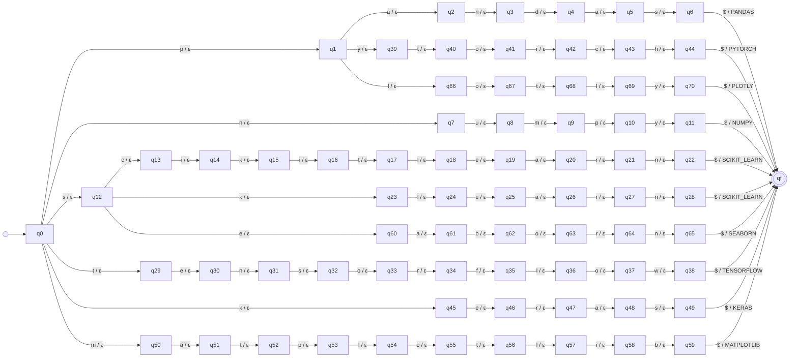

# Transducer libraries

_Generated by `python -m resumelens.docs_export` from the pyformlang objects._

## Diagram

## Formal definition

M = (Q, Σ, Γ, δ, ω, q0, F)

- **Q** (72 states) = {q0, qf, q1, q2, q3, q4, q5, q6, q7, q8, q9, q10, q11, q12, q13, q14, q15, q16, q17, q18, q19, q20, q21, q22, q23, q24, q25, q26, q27, q28, q29, q30, q31, q32, q33, q34, q35, q36, q37, q38, q39, q40, q41, q42, q43, q44, q45, q46, q47, q48, q49, q50, q51, q52, q53, q54, q55, q56, q57, q58, q59, q60, q61, q62, q63, q64, q65, q66, q67, q68, q69, q70}
- **Σ** = {`p`, `a`, `n`, `d`, `s`, `$`, `u`, `m`, `y`, `c`, `i`, `k`, `t`, `l`, `e`, `r`, `o`, `f`, `w`, `h`, `b`}
- **Γ** = {`PANDAS`, `NUMPY`, `SCIKIT_LEARN`, `TENSORFLOW`, `PYTORCH`, `KERAS`, `MATPLOTLIB`, `SEABORN`, `PLOTLY`}
- **q0** = q0
- **F** = {qf}
- **δ** and **ω** (80 transitions). Each row is δ(state, input) = next state and ω(state, input) = output. Every pair that is not in the table is undefined, so the input is rejected.

| state | input | δ: next state | ω: output |
|---|---|---|---|
| q0 | `p` | q1 | ε |
| q1 | `a` | q2 | ε |
| q2 | `n` | q3 | ε |
| q3 | `d` | q4 | ε |
| q4 | `a` | q5 | ε |
| q5 | `s` | q6 | ε |
| q6 | `$` | qf | PANDAS |
| q0 | `n` | q7 | ε |
| q7 | `u` | q8 | ε |
| q8 | `m` | q9 | ε |
| q9 | `p` | q10 | ε |
| q10 | `y` | q11 | ε |
| q11 | `$` | qf | NUMPY |
| q0 | `s` | q12 | ε |
| q12 | `c` | q13 | ε |
| q13 | `i` | q14 | ε |
| q14 | `k` | q15 | ε |
| q15 | `i` | q16 | ε |
| q16 | `t` | q17 | ε |
| q17 | `l` | q18 | ε |
| q18 | `e` | q19 | ε |
| q19 | `a` | q20 | ε |
| q20 | `r` | q21 | ε |
| q21 | `n` | q22 | ε |
| q22 | `$` | qf | SCIKIT_LEARN |
| q12 | `k` | q23 | ε |
| q23 | `l` | q24 | ε |
| q24 | `e` | q25 | ε |
| q25 | `a` | q26 | ε |
| q26 | `r` | q27 | ε |
| q27 | `n` | q28 | ε |
| q28 | `$` | qf | SCIKIT_LEARN |
| q0 | `t` | q29 | ε |
| q29 | `e` | q30 | ε |
| q30 | `n` | q31 | ε |
| q31 | `s` | q32 | ε |
| q32 | `o` | q33 | ε |
| q33 | `r` | q34 | ε |
| q34 | `f` | q35 | ε |
| q35 | `l` | q36 | ε |
| q36 | `o` | q37 | ε |
| q37 | `w` | q38 | ε |
| q38 | `$` | qf | TENSORFLOW |
| q1 | `y` | q39 | ε |
| q39 | `t` | q40 | ε |
| q40 | `o` | q41 | ε |
| q41 | `r` | q42 | ε |
| q42 | `c` | q43 | ε |
| q43 | `h` | q44 | ε |
| q44 | `$` | qf | PYTORCH |
| q0 | `k` | q45 | ε |
| q45 | `e` | q46 | ε |
| q46 | `r` | q47 | ε |
| q47 | `a` | q48 | ε |
| q48 | `s` | q49 | ε |
| q49 | `$` | qf | KERAS |
| q0 | `m` | q50 | ε |
| q50 | `a` | q51 | ε |
| q51 | `t` | q52 | ε |
| q52 | `p` | q53 | ε |
| q53 | `l` | q54 | ε |
| q54 | `o` | q55 | ε |
| q55 | `t` | q56 | ε |
| q56 | `l` | q57 | ε |
| q57 | `i` | q58 | ε |
| q58 | `b` | q59 | ε |
| q59 | `$` | qf | MATPLOTLIB |
| q12 | `e` | q60 | ε |
| q60 | `a` | q61 | ε |
| q61 | `b` | q62 | ε |
| q62 | `o` | q63 | ε |
| q63 | `r` | q64 | ε |
| q64 | `n` | q65 | ε |
| q65 | `$` | qf | SEABORN |
| q1 | `l` | q66 | ε |
| q66 | `o` | q67 | ε |
| q67 | `t` | q68 | ε |
| q68 | `l` | q69 | ε |
| q69 | `y` | q70 | ε |
| q70 | `$` | qf | PLOTLY |
