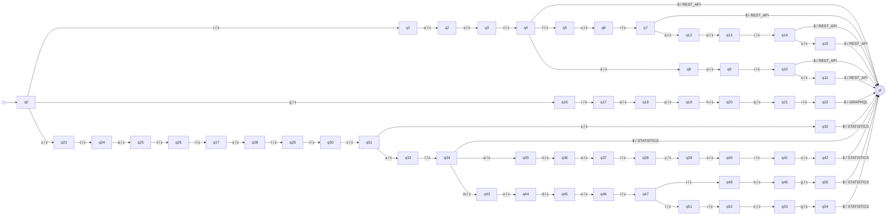

# Transducer other_qualifications

_Generated by `python -m resumelens.docs_export` from the pyformlang objects._

## Diagram

## Formal definition

M = (Q, Σ, Γ, δ, ω, q0, F)

- **Q** (56 states) = {q0, qf, q1, q2, q3, q4, q5, q6, q7, q8, q9, q10, q11, q12, q13, q14, q15, q16, q17, q18, q19, q20, q21, q22, q23, q24, q25, q26, q27, q28, q29, q30, q31, q32, q33, q34, q35, q36, q37, q38, q39, q40, q41, q42, q43, q44, q45, q46, q47, q48, q49, q50, q51, q52, q53, q54}
- **Σ** = {`r`, `e`, `s`, `t`, `$`, `f`, `u`, `l`, `a`, `p`, `i`, `g`, `h`, `q`, `c`, `n`, `y`, `m`, `o`, `d`}
- **Γ** = {`REST_API`, `GRAPHQL`, `STATISTICS`}
- **q0** = q0
- **F** = {qf}
- **δ** and **ω** (66 transitions). Each row is δ(state, input) = next state and ω(state, input) = output. Every pair that is not in the table is undefined, so the input is rejected.

| state | input | δ: next state | ω: output |
|---|---|---|---|
| q0 | `r` | q1 | ε |
| q1 | `e` | q2 | ε |
| q2 | `s` | q3 | ε |
| q3 | `t` | q4 | ε |
| q4 | `$` | qf | REST_API |
| q4 | `f` | q5 | ε |
| q5 | `u` | q6 | ε |
| q6 | `l` | q7 | ε |
| q7 | `$` | qf | REST_API |
| q4 | `a` | q8 | ε |
| q8 | `p` | q9 | ε |
| q9 | `i` | q10 | ε |
| q10 | `$` | qf | REST_API |
| q10 | `s` | q11 | ε |
| q11 | `$` | qf | REST_API |
| q7 | `a` | q12 | ε |
| q12 | `p` | q13 | ε |
| q13 | `i` | q14 | ε |
| q14 | `$` | qf | REST_API |
| q14 | `s` | q15 | ε |
| q15 | `$` | qf | REST_API |
| q0 | `g` | q16 | ε |
| q16 | `r` | q17 | ε |
| q17 | `a` | q18 | ε |
| q18 | `p` | q19 | ε |
| q19 | `h` | q20 | ε |
| q20 | `q` | q21 | ε |
| q21 | `l` | q22 | ε |
| q22 | `$` | qf | GRAPHQL |
| q0 | `s` | q23 | ε |
| q23 | `t` | q24 | ε |
| q24 | `a` | q25 | ε |
| q25 | `t` | q26 | ε |
| q26 | `i` | q27 | ε |
| q27 | `s` | q28 | ε |
| q28 | `t` | q29 | ε |
| q29 | `i` | q30 | ε |
| q30 | `c` | q31 | ε |
| q31 | `s` | q32 | ε |
| q32 | `$` | qf | STATISTICS |
| q31 | `a` | q33 | ε |
| q33 | `l` | q34 | ε |
| q34 | `$` | qf | STATISTICS |
| q34 | `a` | q35 | ε |
| q35 | `n` | q36 | ε |
| q36 | `a` | q37 | ε |
| q37 | `l` | q38 | ε |
| q38 | `y` | q39 | ε |
| q39 | `s` | q40 | ε |
| q40 | `i` | q41 | ε |
| q41 | `s` | q42 | ε |
| q42 | `$` | qf | STATISTICS |
| q34 | `m` | q43 | ε |
| q43 | `o` | q44 | ε |
| q44 | `d` | q45 | ε |
| q45 | `e` | q46 | ε |
| q46 | `l` | q47 | ε |
| q47 | `i` | q48 | ε |
| q48 | `n` | q49 | ε |
| q49 | `g` | q50 | ε |
| q50 | `$` | qf | STATISTICS |
| q47 | `l` | q51 | ε |
| q51 | `i` | q52 | ε |
| q52 | `n` | q53 | ε |
| q53 | `g` | q54 | ε |
| q54 | `$` | qf | STATISTICS |
