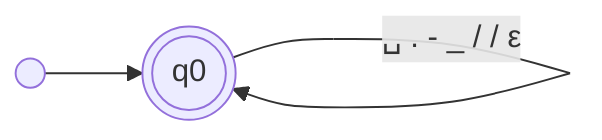

# Transducer PREPROCESSING

_Generated by `python -m resumelens.docs_export` from the pyformlang objects._

## Diagram

## Formal definition

M = (Q, Σ, Γ, δ, ω, q0, F)

- **Q** (1 states) = {q0}
- **Σ** = {`A`, `B`, `C`, `D`, `E`, `F`, `G`, `H`, `I`, `J`, `K`, `L`, `M`, `N`, `O`, `P`, `Q`, `R`, `S`, `T`, `U`, `V`, `W`, `X`, `Y`, `Z`, `a`, `b`, `c`, `d`, `e`, `f`, `g`, `h`, `i`, `j`, `k`, `l`, `m`, `n`, `o`, `p`, `q`, `r`, `s`, `t`, `u`, `v`, `w`, `x`, `y`, `z`, `0`, `1`, `2`, `3`, `4`, `5`, `6`, `7`, `8`, `9`, `+`, `#`, `␣`, `.`, `-`, `_`, `/`}
- **Γ** = {`a`, `b`, `c`, `d`, `e`, `f`, `g`, `h`, `i`, `j`, `k`, `l`, `m`, `n`, `o`, `p`, `q`, `r`, `s`, `t`, `u`, `v`, `w`, `x`, `y`, `z`, `0`, `1`, `2`, `3`, `4`, `5`, `6`, `7`, `8`, `9`, `+`, `#`}
- **q0** = q0
- **F** = {q0}
- **δ** and **ω** (69 transitions). Each row is δ(state, input) = next state and ω(state, input) = output. Every pair that is not in the table is undefined, so the input is rejected.

| state | input | δ: next state | ω: output |
|---|---|---|---|
| q0 | `A` | q0 | a |
| q0 | `B` | q0 | b |
| q0 | `C` | q0 | c |
| q0 | `D` | q0 | d |
| q0 | `E` | q0 | e |
| q0 | `F` | q0 | f |
| q0 | `G` | q0 | g |
| q0 | `H` | q0 | h |
| q0 | `I` | q0 | i |
| q0 | `J` | q0 | j |
| q0 | `K` | q0 | k |
| q0 | `L` | q0 | l |
| q0 | `M` | q0 | m |
| q0 | `N` | q0 | n |
| q0 | `O` | q0 | o |
| q0 | `P` | q0 | p |
| q0 | `Q` | q0 | q |
| q0 | `R` | q0 | r |
| q0 | `S` | q0 | s |
| q0 | `T` | q0 | t |
| q0 | `U` | q0 | u |
| q0 | `V` | q0 | v |
| q0 | `W` | q0 | w |
| q0 | `X` | q0 | x |
| q0 | `Y` | q0 | y |
| q0 | `Z` | q0 | z |
| q0 | `a` | q0 | a |
| q0 | `b` | q0 | b |
| q0 | `c` | q0 | c |
| q0 | `d` | q0 | d |
| q0 | `e` | q0 | e |
| q0 | `f` | q0 | f |
| q0 | `g` | q0 | g |
| q0 | `h` | q0 | h |
| q0 | `i` | q0 | i |
| q0 | `j` | q0 | j |
| q0 | `k` | q0 | k |
| q0 | `l` | q0 | l |
| q0 | `m` | q0 | m |
| q0 | `n` | q0 | n |
| q0 | `o` | q0 | o |
| q0 | `p` | q0 | p |
| q0 | `q` | q0 | q |
| q0 | `r` | q0 | r |
| q0 | `s` | q0 | s |
| q0 | `t` | q0 | t |
| q0 | `u` | q0 | u |
| q0 | `v` | q0 | v |
| q0 | `w` | q0 | w |
| q0 | `x` | q0 | x |
| q0 | `y` | q0 | y |
| q0 | `z` | q0 | z |
| q0 | `0` | q0 | 0 |
| q0 | `1` | q0 | 1 |
| q0 | `2` | q0 | 2 |
| q0 | `3` | q0 | 3 |
| q0 | `4` | q0 | 4 |
| q0 | `5` | q0 | 5 |
| q0 | `6` | q0 | 6 |
| q0 | `7` | q0 | 7 |
| q0 | `8` | q0 | 8 |
| q0 | `9` | q0 | 9 |
| q0 | `+` | q0 | + |
| q0 | `#` | q0 | # |
| q0 | `␣` | q0 | ε |
| q0 | `.` | q0 | ε |
| q0 | `-` | q0 | ε |
| q0 | `_` | q0 | ε |
| q0 | `/` | q0 | ε |
