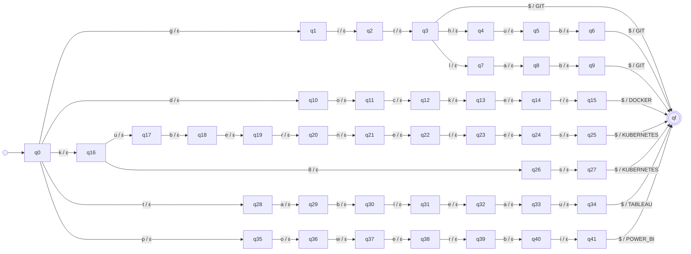

# Transducer tools

_Generated by `python -m resumelens.docs_export` from the pyformlang objects._

## Diagram

## Formal definition

M = (Q, Σ, Γ, δ, ω, q0, F)

- **Q** (43 states) = {q0, qf, q1, q2, q3, q4, q5, q6, q7, q8, q9, q10, q11, q12, q13, q14, q15, q16, q17, q18, q19, q20, q21, q22, q23, q24, q25, q26, q27, q28, q29, q30, q31, q32, q33, q34, q35, q36, q37, q38, q39, q40, q41}
- **Σ** = {`g`, `i`, `t`, `$`, `h`, `u`, `b`, `l`, `a`, `d`, `o`, `c`, `k`, `e`, `r`, `n`, `s`, `8`, `p`, `w`}
- **Γ** = {`GIT`, `DOCKER`, `KUBERNETES`, `TABLEAU`, `POWER_BI`}
- **q0** = q0
- **F** = {qf}
- **δ** and **ω** (49 transitions). Each row is δ(state, input) = next state and ω(state, input) = output. Every pair that is not in the table is undefined, so the input is rejected.

| state | input | δ: next state | ω: output |
|---|---|---|---|
| q0 | `g` | q1 | ε |
| q1 | `i` | q2 | ε |
| q2 | `t` | q3 | ε |
| q3 | `$` | qf | GIT |
| q3 | `h` | q4 | ε |
| q4 | `u` | q5 | ε |
| q5 | `b` | q6 | ε |
| q6 | `$` | qf | GIT |
| q3 | `l` | q7 | ε |
| q7 | `a` | q8 | ε |
| q8 | `b` | q9 | ε |
| q9 | `$` | qf | GIT |
| q0 | `d` | q10 | ε |
| q10 | `o` | q11 | ε |
| q11 | `c` | q12 | ε |
| q12 | `k` | q13 | ε |
| q13 | `e` | q14 | ε |
| q14 | `r` | q15 | ε |
| q15 | `$` | qf | DOCKER |
| q0 | `k` | q16 | ε |
| q16 | `u` | q17 | ε |
| q17 | `b` | q18 | ε |
| q18 | `e` | q19 | ε |
| q19 | `r` | q20 | ε |
| q20 | `n` | q21 | ε |
| q21 | `e` | q22 | ε |
| q22 | `t` | q23 | ε |
| q23 | `e` | q24 | ε |
| q24 | `s` | q25 | ε |
| q25 | `$` | qf | KUBERNETES |
| q16 | `8` | q26 | ε |
| q26 | `s` | q27 | ε |
| q27 | `$` | qf | KUBERNETES |
| q0 | `t` | q28 | ε |
| q28 | `a` | q29 | ε |
| q29 | `b` | q30 | ε |
| q30 | `l` | q31 | ε |
| q31 | `e` | q32 | ε |
| q32 | `a` | q33 | ε |
| q33 | `u` | q34 | ε |
| q34 | `$` | qf | TABLEAU |
| q0 | `p` | q35 | ε |
| q35 | `o` | q36 | ε |
| q36 | `w` | q37 | ε |
| q37 | `e` | q38 | ε |
| q38 | `r` | q39 | ε |
| q39 | `b` | q40 | ε |
| q40 | `i` | q41 | ε |
| q41 | `$` | qf | POWER_BI |
